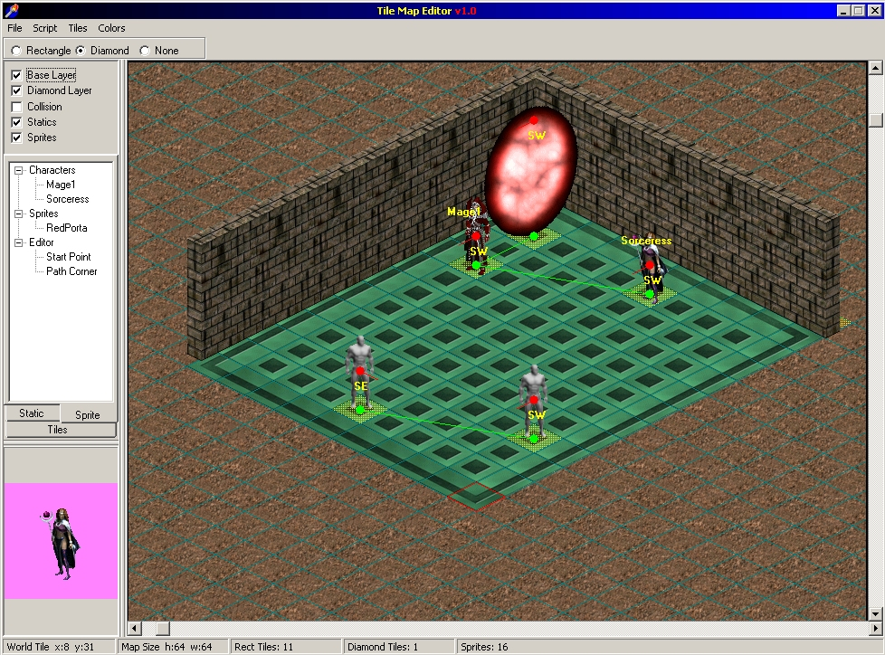

# RF-2D-Engine-ToolSet
All of the Tools I used in creating the game Principal Adversaries

## Character Editor
Character Editor is how you create all of the characters available in the game. You can easily control all of their stats and abilities.

## Sprite Maker
Sprite Maker is used to create and manage animated object in the game. 

## Static Maker
Static Maker is basically a texture packer but it also gives you some game specific control

## Tile Map Editor
This is the tool used to build each of the game level. 

